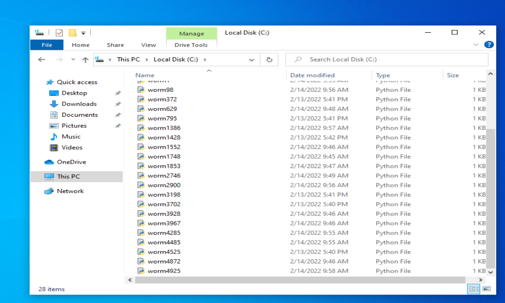
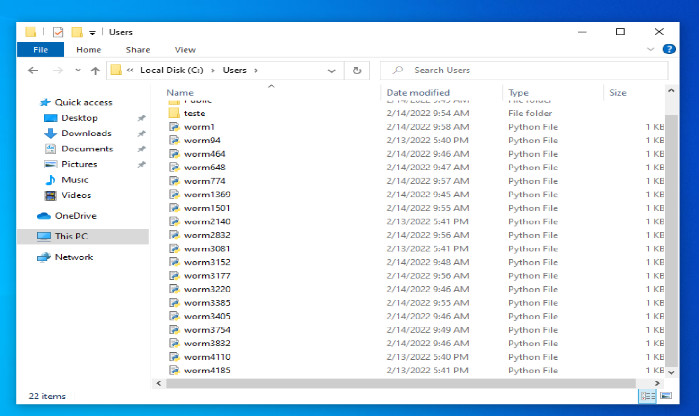
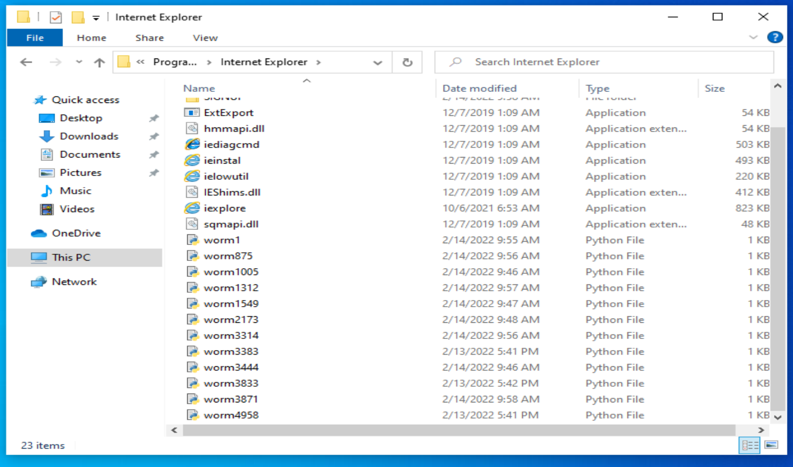
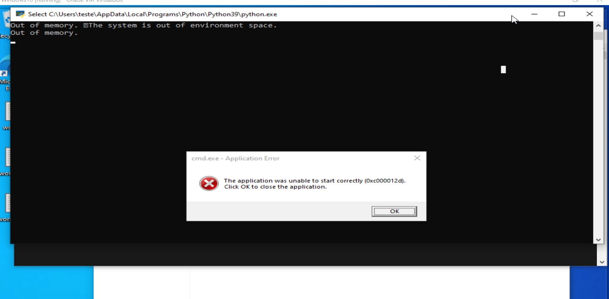

# directory-worm

# Usage
directory-worm is a Python written script that traverses through all the directories in the current Drive it runs in. And subsequently implants worm.py as "worm1.py" in each directory. worm1.py then spreads itself throughout the current working directory. To run it, user must click on main-traverse.py, which would then ask for UAC permission to run as administrator. 

Issues may be encountered as worms palnted in permission locked folders may not be able to duplicate itself due to not having elevated access on its current working directory.

# Disclaimer
This project was written for educational purposes only and is only a simple script that may not be as effective as famous ones. Albeit how amateurish it is, DO not run it unless you're doing it under a test environment. Furthermore, the **author does not condone any malicious usage whatsoever.**

# Future Improvements
* **Changing permission locked folders to be free to be modified by everyone** so that startup bat file won't need to run UAC request anymore.

* **Improve worm1.py** in regards to its speed of replication and increased size as to spread itself out faster and take up more storage space of Drive based in. Furthermore, to become capable of distributing itself out of one single drive.

* **Find balance between CPU usage and speed of replication.** As of now, some worm1.py files are empty as they are either truncated or created with content empty. This is due to the lack of computer resources when running, causing the actual operation of writing binary info of worm.py not to be performed. Furthermore, even if they are created, cmd.exe and python interpreters sometimes can't be invoked.

# References
The script to ask for evelated privelage on windows is referenced here:

https://stackoverflow.com/questions/19672352/how-to-run-script-with-elevated-privilege-on-windows

# Example pictures

